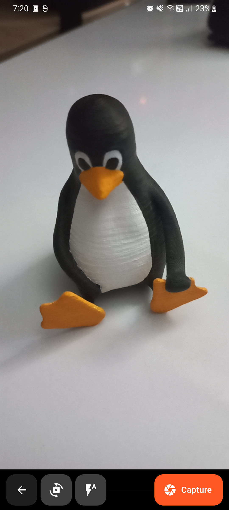

# photocoa 🍫


_Temporary photos app:_ Take pictures without Google Photos syncing them and automatically delete them.

|||
|-|-|
|||
|||

## Compilation
The project is only available in 'Android' though no specific Android libraries where used ('camera' package is managing the Platform specific camera details) so it may work in other OS but I have no way of testing it.

__'flutter_native_splash'__ and __'flutter_launcher_icons'__ require building before running the application, use the following commands:

```sh
flutter pub get
flutter pub run flutter_native_splash:create
flutter pub run flutter_launcher_icons
```

### Release Build
In order to relese build the app you need to precompile the SKSL shaders, you can use the provided __'flutter_01.sksl.json'__ file or provide your own via the command:
```sh
flutter run --profile --cache-sksl --purge-persistent-cache --dump-skp-on-shader-compilation
```
Trigger as much animations as you can and then press __M__ inside the command-line to export the __'flutter_01.sksl.json'__ file

Then compile the __.apk__ application using the following command
```sh
flutter build apk --obfuscate --split-debug-info=build/app/output/symbols --no-track-widget-creation --release --bundle-sksl-path flutter_01.sksl.json --no-tree-shake-icons -v
```